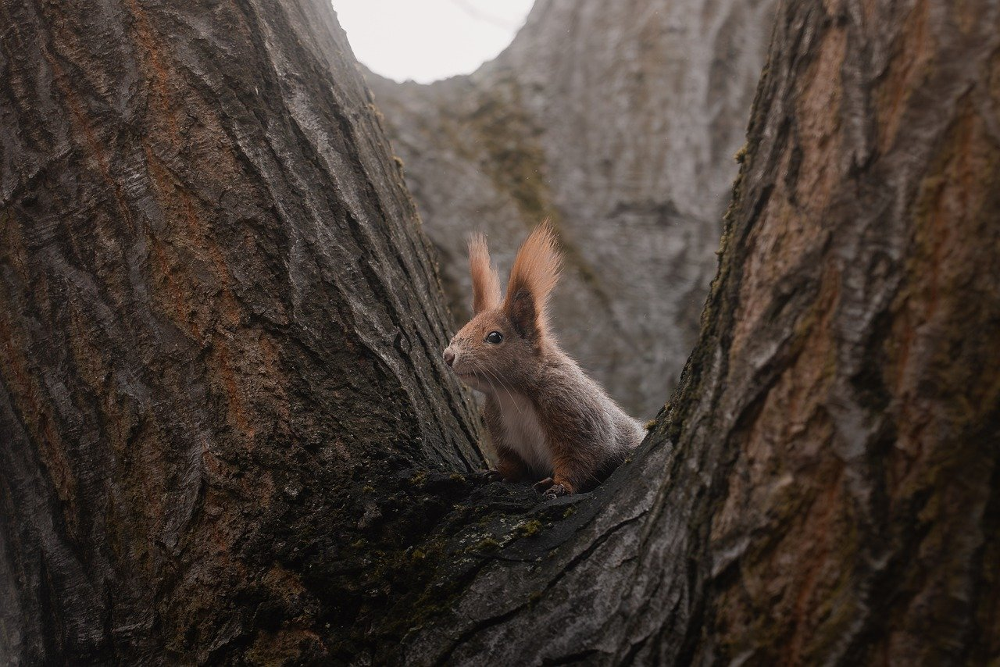

## Map Preview

***

Below is an interactive preview of the Rotterdam Touch Grass map. Use your mouse wheel to zoom in and out.

  

***

## About the artist

The Rotterdam Touch Grass map was created by Sara Baldwin as her graduation project at Willem de Kooning Academy. This map is supposed to verbatim verbatim verbatim verbatim verbatim verbatim verbatim verbatim verbatim verbatim verbatim verbatim verbatim verbatim verbatim verbatim verbatim verbatim verbatim verbatim verbatim verbatim verbatim verbatim.
